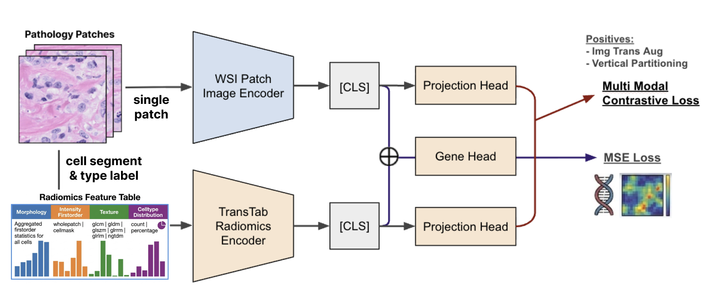

# RaPaCL-ST
RadiomicsFeature-Pathomics Contrastive Learning for Spatial Transcriptomics prediction. 

**RaPaCL-ST (RadiomicsFeature-Pathomics Contrastive Learning for Spatial Transcriptomics prediction)** is a multimodal representation learning framework designed to bridge handcrafted radiomics features and deep pathomics features derived from histopathology images, which aim to predict spatial gene expression value in patch-wise level. In this approach, radiomics features extracted from image patches serve as structured, interpretable signals, while deep learning based patch image encoders encode high-dimensional visual representations. RaPaCL leverages contrastive learning to align these two modalities in a shared latent space, encouraging consistency between radiomics-informed characteristics (e.g., texture, heterogeneity) and deep image embeddings. By doing so, the framework aims to enhance the biological relevance and interpretability of learned representations, ultimately improving downstream tasks such as spatial gene expression prediction and tumor characterization in whole-slide images. 

---

## Description 

### Prepare Data & Run Baselines

Please refer to: `src/dataset/README.md` and `src/baselines/README.md`. 

### Intra-Tabular Pretraining (Radiomics TransTab)

Please refer to: `src/radtranstab/README.md`. 

---

### Run RaPaCL

... 

---

